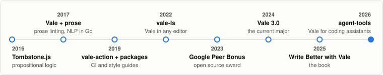

# Joseph Kato

[](https://jdkato.io) [](https://vale.sh) [](mailto:joseph@jdkato.io) [](https://github.com/sponsors/jdkato) [](https://github.com/jdkato/jdkato/actions/workflows/main.yml)

I'm Joseph. I make things and write about them.

Since 2017 that has meant [Vale](https://github.com/vale-cli/vale), a linter that treats prose like code, used by docs teams at AWS, Microsoft, GitLab, and Red Hat. Lately it means teaching Vale to work alongside coding assistants: [agent-tools](https://github.com/vale-cli/agent-tools) ships it as Claude Code skills, an edit-time hook, and an MCP server. Before that I wrote [prose](https://github.com/jdkato/prose), a Natural Language Processing library for Go.

On [jdkato.io](https://jdkato.io) I point the same habit at public data: how much arXiv abstracts hedge, who talks at Supreme Court oral argument, what 89,000 graded NBA calls say about referees, and whether vibe-coded pull requests actually burden maintainers.

<picture>
  <source media="(prefers-color-scheme: dark)" srcset="assets/stats-dark.svg">
  
</picture>

<sub>Numbers refresh nightly from the GitHub, Docker Hub, Homebrew, and VS Code Marketplace APIs. This README is linted by Vale on every push. See [`scripts/stats.py`](scripts/stats.py).</sub>

#### ✍️ Latest essays

<!-- essays:start -->
* **[The hedge words of science](https://jdkato.io/stories/arxiv-hedging)** (Aug 2026). Scientists are trained to qualify their claims. Across 2,400 arXiv abstracts, how much a field hedges turns out to track something simpler than caution — whether it observes the world or proves things about it. And despite the reputation, hedging isn't on the rise.
* **[AI Tells: the burden of LLMs](https://jdkato.io/stories/github-ai-tells)** (Aug 2026). Codeberg's members just voted to ban vibe-coded projects, which is one way of saying the question has stopped being rhetorical. I build a prose linter, so I pointed it at a decade of GitHub instead — and the load turns out to be real, to land on pull requests rather than issues, and to look nothing like the tells everyone repeats.
* **[Who does the talking](https://jdkato.io/stories/scotus-oral-argument)** (Jun 2026). At Supreme Court oral argument the justices share a fixed hour, and they split it about as unevenly as they split anything else. Six terms of transcripts show who spends the Court's time, who barely does, and the newest justice who out-talks them all.
<!-- essays:end -->

#### 🔭 Now

<!-- release:start -->
* Shipping Vale. The latest release is [v3.20.0](https://github.com/vale-cli/vale/releases/tag/v3.20.0), published 2026-09-02.
<!-- release:end -->
* Building [agent-tools](https://github.com/vale-cli/agent-tools) and Vale CMS, so prose linting happens where the writing now happens: inside coding assistants.
* Writing data essays on language and public records at [jdkato.io](https://jdkato.io).

#### 🧰 The Vale ecosystem

| Project | What it does |
| --- | --- |
| [vale](https://github.com/vale-cli/vale) | The linter itself. Markup-aware, fast, and extensible. Written in Go. |
| [packages](https://github.com/vale-cli/packages) | Ready-made style guides: [Microsoft](https://github.com/vale-cli/Microsoft), [Google](https://github.com/vale-cli/Google), [IBM](https://github.com/vale-cli/IBM), [write-good](https://github.com/vale-cli/write-good), [proselint](https://github.com/vale-cli/proselint), and more. |
| [vale-ls](https://github.com/vale-cli/vale-ls) | A Language Server Protocol implementation, so Vale works in any editor. |
| [vale-action](https://github.com/vale-cli/vale-action) | The official GitHub Action. It lints this README on every push. |
| [agent-tools](https://github.com/vale-cli/agent-tools) | Skills, an edit-time hook, and an MCP server for coding assistants. |
| [prose](https://github.com/jdkato/prose) | Tokenization, part-of-speech tagging, and named-entity extraction in Go. |

Try it in Claude Code:

```
/plugin marketplace add vale-cli/agent-tools
/plugin install vale@agent-tools
```

Or on the command line:

```sh
brew install vale && vale sync && vale README.md
```

<picture>
  <source media="(prefers-color-scheme: dark)" srcset="assets/timeline-dark.svg">
  
</picture>

<picture>
  <source media="(prefers-color-scheme: dark)" srcset="https://api.star-history.com/svg?repos=vale-cli/vale,jdkato/prose&type=Date&theme=dark">
  
</picture>

#### 📌 Elsewhere

* **[Write Better with Vale][3]**, a Pragmatic Bookshelf title on automating style guides.
* **[Google Open Source Peer Bonus][1]** recipient, 2023.
* Featured in **[Golang Weekly][2]** for Go-based NLP and tooling.
* **[Appwrite OSS Fund][5]** grantee, one of twenty projects selected.
* Featured in a Udemy course, **[Go for Data Science and Natural Language Processing][6]**, for prose and Go NLP.
* Want to talk prose linting, docs tooling, or a data story? Email me.

[1]: https://opensource.googleblog.com/2023/05/google-open-source-peer-bonus-program-announces-first-group-of-winners-2023.html
[2]: https://golangweekly.com
[3]: https://pragprog.com/titles/bhvale/write-better-with-vale/
[5]: https://dev.to/appwrite/appwrite-oss-fund-sponsors-vale-4oig
[6]: https://www.udemy.com/course/go-for-data-science-and-natural-language-processing-golang/
