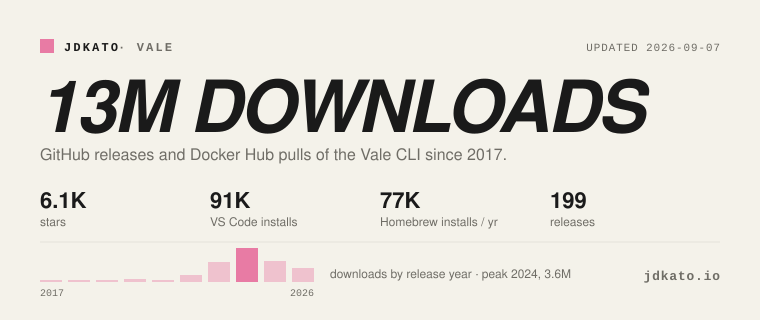

# Joseph Kato

[jdkato.io](https://jdkato.io) · [vale.sh](https://vale.sh) · [joseph@jdkato.io](mailto:joseph@jdkato.io) · [Sponsor](https://github.com/sponsors/jdkato)

I'm Joseph. I make things and write about them.

Since 2017 that has meant [Vale](https://github.com/vale-cli), a linter that treats prose like code, used by docs teams at AWS, Microsoft, GitLab, and Red Hat. Lately it means teaching Vale to work alongside coding assistants: [agent-tools](https://github.com/vale-cli/agent-tools) ships it as Claude Code skills, an edit-time hook, and an MCP server. Before that I wrote [prose](https://github.com/jdkato/prose), a Natural Language Processing library for Go.

<picture>
  <source media="(prefers-color-scheme: dark)" srcset="assets/stats-dark.svg">
  
</picture>

Refreshed nightly by [`scripts/stats.py`](scripts/stats.py). Vale lints this README on every push.

#### ✍️ Latest essays

<!-- essays:start -->

<!-- essays:end -->

#### 📌 Elsewhere

* **[Write Better with Vale][3]**, a Pragmatic Bookshelf title on automating style guides.
* **[Google Open Source Peer Bonus][1]** recipient, 2023.
* **[Appwrite OSS Fund][5]** grantee, one of twenty projects selected.
* Want to talk prose linting, docs tooling, or a data story? Email me.

[1]: https://opensource.googleblog.com/2023/05/google-open-source-peer-bonus-program-announces-first-group-of-winners-2023.html
[3]: https://pragprog.com/titles/bhvale/write-better-with-vale/
[5]: https://dev.to/appwrite/appwrite-oss-fund-sponsors-vale-4oig
